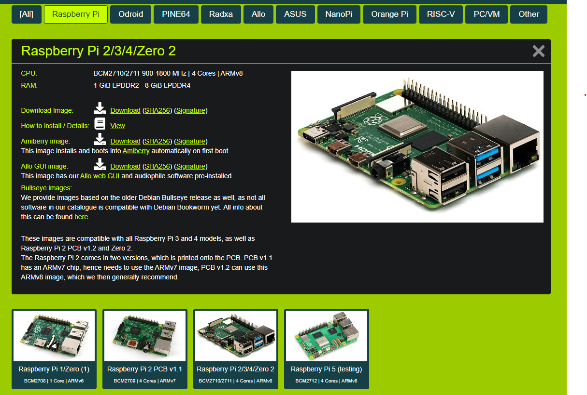

# What is this 
Python3 application that allows to bridge source of GCODE from a serial interface and feed them directly into [Moonraker](https://github.com/Arksine/moonraker) (in other words a [Klipper](https://www.klipper3d.org/) printer) via the network.

# What is it for
This tool is particularly useful to control Klipper via external softwares or devices that only control 3d printers, lasers, CNCs via a physical serial port. 

A few examples:
- [Mosaic Palette 3 (Pro)](https://www.mosaicmfg.com/products/palette-3-pro)
- [Lightburn](https://lightburnsoftware.com/)

# Current state
It is in very early stage, but it will get an install script and run as a service to make the setup as easy as possible.
As of now the script is fully functional, but it doesn't actively check or recovers from failures.
In practice it has been very reliable with my Palette 3 Pro in connected mode.

# This setup
The bridge can run on a klipper install, but to keep thing simple we will focus on creating a dedicated wifi bridge based on the Raspberry Pi Zero 2W.

# Why the Pi Zero 2W 
The Pi Zero 2W offers something called USB serial gadget. This allows it to run as a USB serial slave without the need for custom cables. This can run similarly on a Pi 3/4 with a dedicated pair of serial converters, but this approach is simpler.

The slave mode is required because the Palette 3 (Pro) requires a serial slave to be connected on its USB ports (like a Marlin based printer).

Also the Pi Zero 2W can be powered out of the Palette 3 (Pro) directly.

# Install

Note: We base this entire setup on DietPi, but it works very similarly on RaspberryPi OS Lite. Diet Pi is used because it offers the benefit of being faster to flash, faster to boot and lighter to run on ram. If you are more comfortable with Pi OS Lite, please use it.

## Diet Pi
Let's start with a fresh install of [DietPi](https://dietpi.com/#downloadinfo) for the Pi Zero 2. Download the ARMv8 version.



Please follow the install guide from DietPi https://dietpi.com/docs/install/
Before booting the first time follow the text based setup https://dietpi.com/docs/usage/#how-to-do-an-automatic-base-installation-at-first-boot-dietpi-automation

Do not boot yet !!!!

In the file **dietpi.txt** consider the following setting to disable the HDMI as it is useless in this case.
```
AUTO_SETUP_HEADLESS=1
```

## Setup the USB serial gadget
To be able to use the USB serial gadget we need to modify the file config.txt and cmdline.txt

In the file **config.txt** at the end of the file append the line:
```
dtoverlay=dwc2
```

In the file **cmdline.txt** at the end of the first line append:
```
modules-load=dwc2,g_serial
```

See https://learn.adafruit.com/turning-your-raspberry-pi-zero-into-a-usb-gadget/serial-gadget for reference.


## Install dependencies
The tool has 3 notable dependencies to install:
- [PySerial](https://pyserial.readthedocs.io/en/latest/index.html) for the serial connection.
- [Python Websockets](https://websockets.readthedocs.io/en/stable/) to keep the connection with Moonraker.
- [Flask](https://flask.palletsprojects.com/en/3.0.x/) to provide a Web based frontend.

Run:
```
sudo apt-get install python3-serial python3-websockets python3-flask git
```

Then clone this repository:
```
cd ~ && git clone https://github.com/shishu94/Klipperotchy.git
```

## Autostart bridge
TODO: cleanup this section, add systemd for autostart, consider package the flask app (wheel) and use Waitress to run the server.

```
flask --app app run --host=0.0.0.0
```
